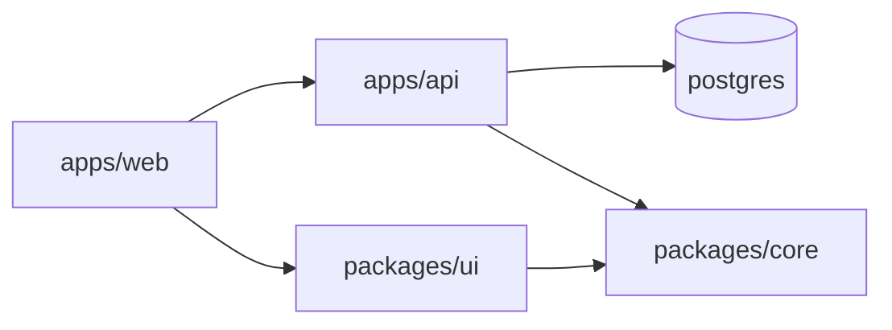

# Writing ARCHITECTURE.md

## What this file is for

The gap between a newcomer and a core developer is mostly knowledge of *physical* architecture — where things live. As matklad put it: it takes maybe 2× longer to write a patch in an unfamiliar codebase, but 10× longer to work out *where* the patch goes. `ARCHITECTURE.md` closes that second gap, which is the expensive one.

Two questions it must answer:

1. Where's the thing that does X?
2. What does the thing I'm looking at do, and what may it depend on?

## The stability test

Write at an altitude where routine refactors don't invalidate you. Concretely:

- **Name** modules, directories and important types. **Don't link** to files or line numbers — links rot silently and a rotted link is worse than none. Name things precisely enough that symbol search finds them.
- Describe *responsibilities*, not signatures or implementations.
- If a sentence would be false after someone renames a function or splits a file, raise its altitude or cut it.

A good `ARCHITECTURE.md` gets revisited a couple of times a year, not on every PR. If yours needs updating weekly, it's written too low.

It is a map of a country, not an atlas of maps of its states. Everyone who works on the repo repeatedly will read it, so keep it readable in one sitting.

## Structure

```markdown
# Architecture

## Overview

<2–4 paragraphs. What problem does this system solve, and what's the shape of the
solution? Someone who has never seen the repo should be able to read this and then
make sense of the codemap. Include the runtime picture if there is one — what
processes exist, what talks to what, where data lives.>

## Codemap

<One entry per coarse-grained component. Directories and packages, not files.
Aim for something a reader can hold in their head — if you're past ~20 entries,
you're too fine-grained, or the repo needs sub-architecture docs.>

### `<path/to/component>`
<What it does, in one or two sentences.> Depends on: `<...>`. Consumed by: `<...>`.
<Anything surprising about it.>

### `<path/to/next>`
...

## How the pieces relate

<The dependency picture the codemap entries imply, stated once. Layering, allowed
and forbidden edges, direction of data flow. A diagram helps here — mermaid, or
ASCII if the repo's other docs are plain.>

## Shared code

<What's shared, where it lives, and the rules for using it: what may depend on
shared libraries and what may not, how breaking changes to them are handled, how
versions are pinned. In a monorepo this is usually the section people most need.>

## Cross-cutting concerns

<Auth, configuration, logging, error handling, telemetry, migrations, i18n —
whichever exist. For each: where the implementation lives and the rule for using
it, e.g. "all config is read through `internal/config`; never read env vars
directly outside it".>

## Invariants

<Properties that must hold, especially the ones expressed as an absence. These are
the highest-value lines in the document because they are invisible in the code —
nothing about reading a file tells you what it must never do.>

- `<core>` performs no I/O; all effects are injected by callers.
- Nothing under `<packages/*>` may import from `<apps/*>`.
- `<generated/>` is produced by `<cmd>` and must never be hand-edited.

## Gotchas

<Things that will surprise someone making a reasonable change. Historical
accidents, deliberate-looking mistakes that aren't, performance-critical paths
that look ordinary, workarounds for upstream bugs. Each one saves a future
debugging session, so include the *why* — a gotcha without a reason gets
"cleaned up" by the next person.>
```

Drop sections with nothing real in them. Most repos won't have all of these.

## Monorepos

The codemap is the load-bearing section. Structure it by deployable or package, and make the dependency rules explicit — in a monorepo, the thing people get wrong is not what a package *does* but what it's *allowed to reach*. If the repo enforces boundaries with tooling (Nx tags, `depcruise`, ESLint import rules, Bazel visibility, Go internal packages), name that tool: a rule with an enforcer is far more credible than a rule in prose.

If any single component is complex enough to need its own architecture write-up, give it a `README.md` in its own directory and link to it from its codemap entry, rather than letting the root document swell.

## Diagrams

One diagram of component relationships pays for itself. Mermaid renders on GitHub and in most editors and stays diffable, so prefer it unless the repo already uses something else:

````markdown

````

Keep it to the coarse-grained picture. A diagram that needs updating on every PR won't be updated.

## What does not belong here

- **How a module works inside** — that's a module `README.md` or code comments. This document says what a module is *for*, not how it's built.
- **API reference** — generate it from the source.
- **Decision history and rejected alternatives** — those are ADRs (`docs/adr/NNNN-title.md`). Architecture describes the current state; an ADR records a dated decision and can be superseded without rewriting anything else.
- **Roadmap and aspirational architecture** — a reader can't tell aspiration from description, so mixing them makes the whole document untrustworthy. If you must, mark it unmistakably under its own heading.
- **Line numbers, exact file links, function signatures** — stale on arrival.
